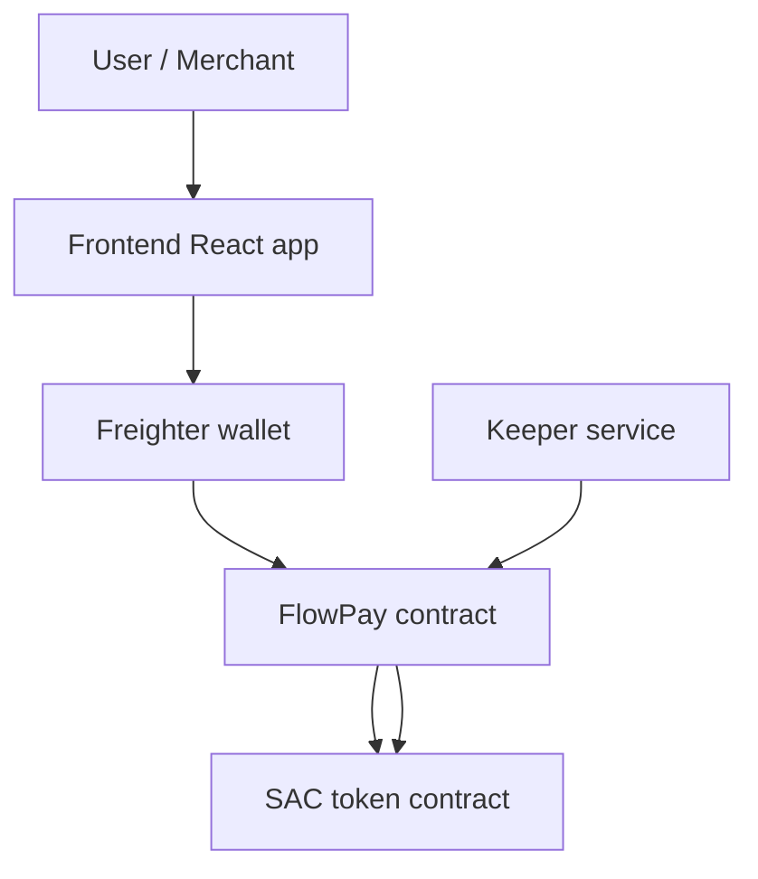

# Architecture

This document describes the current FlowPay contract architecture, module responsibilities, storage layout, event flow, and frontend integration.

---

## System Overview

FlowPay has two runtime pieces:

1. The Soroban contract in `contract/src/`, which owns subscription state and all on-chain policy.
2. The React frontend in `frontend/`, which builds transactions and submits them through Freighter.

A [keeper](./GLOSSARY.md#keeper) process is the only off-chain service required for recurring billing. It calls `charge()` or `batch_charge()` on schedule.



---

## Contract Modules

| Module                     | Responsibility                                                                          |
| -------------------------- | --------------------------------------------------------------------------------------- |
| `lib.rs`                   | Public entry points, contract data types, storage keys, and cross-module orchestration. Also owns `subscribe_inner`, `pay_per_use_inner`, `check_and_update_global_volume`, and TTL extension logic. |
| `admin.rs`                 | `require_admin`, admin initialization, and two-step admin transfer (`transfer_admin` / `accept_admin`). |
| `batch.rs`                 | `batch_charge`, `batch_cancel`, `batch_extend_subscription_ttl`. Defines `ChargeResult` and `CancelResult` enums. Default `MAX_BATCH_SIZE = 50`. |
| `bench.rs`                 | Instruction-count benchmarks gated by `#[cfg(feature = "bench")]`. Not compiled by `cargo test` unless `--features bench` is passed. |
| `charge_exec.rs`           | Charge prechecks (`precheck_charge`), auto-resume logic (`try_auto_resume`), simulation (`simulate_charge`), and fee-aware transfer execution (`execute_charge`). Defines `ChargeSimResult` enum. |
| `errors.rs`                | `ContractError` enum with 34 variants.                                                  |
| `events.rs`                | All `publish_*` event helpers (~30+ event types) and event data structs.                 |
| `fee.rs`                   | Protocol fee calculation (`calculate_fee_amount`), two-step propose/commit, fee-aware transfers (`transfer_subscription_charge`, `transfer_pay_per_use`), cumulative fee tracking, and per-merchant fee recipient routing. |
| `grace.rs`                 | Two-step grace period proposal and commit.                                              |
| `limits.rs`                | Placeholder — currently empty.                                                          |
| `merchant_stats.rs`        | Per-merchant revenue tracking (cumulative, daily buckets, history Vec), subscriber counts, merchant index for ranking, and revenue summaries. |
| `migration.rs`             | Schema version tracking (current: v3), v1→v2 migration (add `paused` field), v2→v3 migration (populate `referrer`). |
| `min_interval.rs`          | Minimum billing interval floor (default 3600s).                                         |
| `referral.rs`              | Referrer storage, lookup, removal, and self-referral check. See [REFERRALS.md](./REFERRALS.md). |
| `spending_limit.rs`        | Per-user daily spending limits using temporary storage (~1 day TTL), day window anchoring via `DayStart` key. |
| `storage.rs`               | Low-level storage helpers: subscription get/set, TTL extension, admin get/set, token get, contract pause get/set, pause expiry get/set/clear. |
| `subscription_count.rs`    | Active subscription counter (instance), append-only subscriber index with tombstoning, per-merchant subscriber count. |
| `subscription_history.rs`  | Per-user charge history (max 12 entries, circular buffer), paginated reads with ascending/descending sort. |
| `subscription_metadata.rs` | Short subscription labels (max 64 bytes).                                               |
| `token.rs`                 | **Not used by FlowPay.** Contains an unrelated `AcademyVestingContract`.                |
| `test.rs`                  | Contract unit tests.                                                                    |
| `trial.rs`                 | Trial period end computation and trial extension.                                       |
| `upgrade.rs`               | Two-step WASM upgrade (propose/commit) and upgrade event emission.                      |
| `validation.rs`            | Shared validation helpers for amounts, intervals, and allowance checks.                 |
| `whitelist.rs`             | Merchant whitelist with indexed pagination, freeze/unfreeze with reasons, whitelist enabled toggle. |

---

## Data Flow

### Subscription creation

1. `subscribe()` or `subscribe_with_metadata()` validates auth, whitelist state, minimum interval, and token allowance.
2. `storage.rs` writes the `Subscription` record.
3. `subscription_count.rs` updates the active count and subscriber index when needed.
4. `referral.rs` stores an optional referrer.
5. `subscription_metadata.rs` stores an optional label for the metadata path.
6. `events.rs` emits the subscription event.

### Recurring charge

1. `charge()` loads the subscription and checks pause, interval, and grace period state.
2. `fee.rs` calculates any protocol fee split.
3. The token contract performs `transfer_from()`.
4. `merchant_stats.rs` records merchant revenue.
5. `subscription_history.rs` records the successful charge timestamp.
6. `events.rs` emits `charged`.

### Batch charge

1. `batch_charge()` iterates over a list of subscriber addresses.
2. `batch.rs` reuses the same charge eligibility checks as the single-charge path.
3. Each user produces a `ChargeResult` instead of aborting the whole transaction.

### Merchant analytics

1. `merchant_stats.rs` stores cumulative revenue and daily revenue buckets.
2. Read helpers expose total revenue, per-day revenue, and subscriber counts.
3. Administrative reset helpers clear or zero selected counters without affecting subscription state.

### Metadata and history

1. `subscription_metadata.rs` stores short labels.
2. `subscription_history.rs` stores charge timestamps and supports paging and clearing.
3. `referral.rs` stores the original referrer, if any.

---

## Storage Strategy

FlowPay uses Soroban instance, persistent, and temporary storage deliberately.

| DataKey                             | Purpose                                                    | Storage type |
| ----------------------------------- | ---------------------------------------------------------- | ------------ |
| `Token`                             | Default payment token                                      | instance     |
| `Admin`                             | Current admin                                              | instance     |
| `PendingAdmin`                      | Two-step admin transfer target                             | instance     |
| `ContractPaused`                    | Global pause flag                                          | instance     |
| `PauseExpiry(user)`                 | Pause expiry timestamp for auto-resume                     | persistent   |
| `GracePeriod`                       | Charge grace window                                        | instance     |
| `WhitelistEnabled`                  | Merchant whitelist flag                                    | instance     |
| `FeeCollector` / `FeeBps`           | Protocol fee configuration                                 | instance     |
| `MinFeeBps` / `MaxFeeBps`           | Fee bounds guardrails                                      | instance     |
| `PendingFee`                        | Pending fee proposal                                       | temporary    |
| `PendingGracePeriod`                | Pending grace-period proposal                              | temporary    |
| `MinInterval`                       | Minimum allowed subscription interval                      | instance     |
| `SchemaVersion`                     | Storage schema version                                     | instance     |
| `ActiveCount`                       | Active subscription count                                  | instance     |
| `MaxBatchSize`                      | Configurable batch size limit (max 200, default 50)        | instance     |
| `GlobalVolumeWindow`                | Rolling volume cap state                                   | instance     |
| `GlobalVolumeCapOverride`           | Admin-configurable volume cap override                     | instance     |
| `TotalProtocolFees`                 | Cumulative protocol fees across all charges                | instance     |
| `SubscriberIndexSize`               | Append-only subscriber count                               | instance     |
| `Subscription(user)`                | Subscriber subscription record                             | persistent   |
| `MerchantWhitelist(merchant)`       | Whitelisted merchant flag                                  | persistent   |
| `MerchantFrozen(merchant)`          | Frozen merchant flag                                       | persistent   |
| `MerchantFreezeReason(merchant)`    | Freeze reason string                                       | persistent   |
| `MerchantRevenue(merchant)`         | Cumulative merchant revenue                                | persistent   |
| `MerchantRevenueDay(merchant, day)` | Daily revenue bucket                                       | persistent   |
| `MerchantRevenueDayIndex(merchant)` | Index of which days have revenue                           | persistent   |
| `MerchantRevenueHistory(merchant)`  | History vector for revenue reads                           | persistent   |
| `MerchantSubCount(merchant)`        | Active subscriber count per merchant                       | persistent   |
| `MerchantFeeRecipient(merchant)`    | Per-merchant custom fee recipient                          | persistent   |
| `MerchantIndex(i)` / `MerchantIndexSize` | Merchant index for top-by-subs ranking               | persistent   |
| `MerchantKnown(merchant)`           | Dedup flag for merchant indexing                            | persistent   |
| `DailyLimit(user)`                  | Temporary pay-per-use limit                                | temporary    |
| `DailySpent(user)`                  | Temporary pay-per-use spend counter                        | temporary    |
| `DayStart(user)`                    | Day window anchor for daily spending limits                | temporary    |
| `Referral(user)`                    | Referrer for a subscriber ([REFERRALS.md](./REFERRALS.md)) | persistent   |
| `SubscriptionMeta(user)`            | Short subscription label                                   | persistent   |
| `ChargeHistory(user)`               | Charge timestamps                                          | persistent   |
| `SubscriberIndex(i)`                | Append-only subscriber list entry                          | persistent   |
| `SubscriberIndexSlot(user)`         | Reverse lookup for subscriber index pruning                | persistent   |
| `SubscriberIndexRemoved(i)`         | Tombstone flag for subscriber index entry                  | persistent   |
| `PendingUpgrade`                    | Two-step upgrade hash                                      | temporary    |

Persistent entries that must remain available are refreshed with TTL extensions where needed, most importantly subscription records and selected merchant-revenue data. Temporary entries are used for short-lived proposals and daily spending caps.

`PendingAdmin`, `PendingFee`, `PendingGracePeriod`, and (not shown above) `PendingUpgrade` all back a propose/commit or propose/accept two-step authorization flow rather than an instant admin action. See [architecture/two-step-auth.md](./architecture/two-step-auth.md) for the security rationale and a state diagram per flow.
Each `Subscription(user)` record carries its own `token` address rather than sharing one contract-wide token, which is what lets a single deployment serve subscribers paying in different SAC tokens. See [MULTI-TOKEN.md](./MULTI-TOKEN.md) for the full architecture, deployment models, and fee implications.

---

## Event Architecture

Events are emitted from `events.rs` and kept separate from storage mutation so the public contract methods remain small.

| Event                                                           | Trigger                                                       |
| --------------------------------------------------------------- | ------------------------------------------------------------- |
| `subscribed`                                                    | New or replaced subscription created                          |
| `referred`                                                      | Referrer stored on subscribe ([REFERRALS.md](./REFERRALS.md)) |
| `charged`                                                       | Successful recurring charge                                   |
| `pay_per_use`                                                   | Successful one-time charge                                    |
| `cancelled`                                                     | Subscription cancelled                                        |
| `cancelled_with_refund`                                         | Subscription cancelled with prorated refund                   |
| `trial_extended`                                                | Trial period extended                                         |
| `paused` / `resumed`                                            | Subscription pause state changed (user-initiated)             |
| `subscription_paused`                                           | Subscription paused via batch admin operation                 |
| `subscription_auto_resumed`                                     | Pause expiry passed; subscription auto-resumed on charge      |
| `admin_transferred`                                             | Two-step admin transfer completed                             |
| `fee_proposed` / `fee_committed` / `fee_cleared`                | Fee configuration changed                                     |
| `merchant_fee_recipient_set`                                    | Per-merchant custom fee recipient configured                  |
| `merchant_added` / `merchant_removed`                           | Whitelist updated                                             |
| `merchant_frozen` / `merchant_unfrozen`                         | Merchant freeze state changed                                 |
| `grace_period_proposed` / `grace_period_committed`              | Grace period updated                                          |
| `sub_amount_updated` / `sub_interval_updated`                   | Admin adjusted a subscription                                 |
| `merchant_withdrawal`                                           | Merchant withdrew revenue                                     |
| `daily_limit_set` / `daily_limit_removed`                       | Daily limit updated                                           |
| `daily_window_started`                                          | Daily spending window reset for a user                        |
| `subscription_transferred`                                      | Subscription ownership moved                                  |
| `sub_transferred`                                               | Legacy subscription transfer event                            |
| `min_interval_set`                                              | Minimum subscription interval updated                         |
| `merch_hist_cleared`                                            | Merchant revenue history cleared                              |
| `contract_paused` / `contract_unpaused`                         | Global contract pause toggled                                 |
| `upgrade`                                                       | Contract WASM upgraded                                        |
| `upg_proposed`                                                  | WASM upgrade proposed (two-step)                              |
| `migration_completed`                                           | Storage schema migration finished                             |
| `subscriber_index_ttl_extended`                                 | Subscriber index TTL refreshed                                |
| `subscriber_index_cleared`                                      | Admin repaired a stale subscriber index slot                  |

Events are the main off-chain integration surface for analytics, indexers, and the keeper workflow.

Merchants and auditors who need to turn those events into a finance-oriented audit trail (exports, reconciliation, retention) should follow [COMPLIANCE.md](./COMPLIANCE.md).

---

## Frontend Interaction

The frontend does not talk to the contract directly. `frontend/src/stellar.ts` builds and simulates Soroban transactions, then Freighter signs them.

```
App.tsx
├── useWallet()          — Freighter connection, signing, submission
├── SubscribeForm.tsx    — form to create a subscription
├── Dashboard.tsx        — view subscription, cancel, pay-per-use
├── MerchantDashboard.tsx — merchant subscriber management
└── AdminDashboard.tsx   — admin diagnostics and subscription repair
```

### Admin repair workflow

1. Admin connects Freighter wallet; `useAdmin` compares `publicKey` to on-chain `get_admin`.
2. Operator enters a subscriber address and runs `validate_subscription` via RPC simulation.
3. Violations are mapped to human-readable messages in the UI (missing records, invalid transitions, corrupted references).
4. If failures exist and the wallet is admin, `repair_subscription` is submitted after confirmation.
5. The UI parses the `subscription_repaired` event for the exact fixed-inconsistency count and re-runs validation.

Authorization is enforced both in the UI (repair button disabled for non-admins) and on-chain (`require_admin` in the contract).

All Soroban SDK calls are isolated in `stellar.ts`. Components never import `@stellar/stellar-sdk` directly. This makes it easy to swap the SDK version or mock it in tests.

Typical flows:

- Subscribe: build transaction, simulate, sign, submit.
- Charge or pay-per-use: same transaction pipeline, but the user or keeper supplies the target address.
- Dashboard reads: call read-only entry points like `get_subscription()`, `get_protocol_stats()`, and `get_charge_history()`.

The frontend is intentionally thin. It should remain a transaction builder and state viewer, not a source of business logic.

---

## Benchmarks

`contract/src/bench.rs` contains instruction-count benchmarks for `subscribe()`, `charge()`, `pay_per_use()`, and a 10-user `batch_charge()` scenario. These are separate from unit tests and should be used to catch cost regressions.

The benchmark module is gated with `#[cfg(feature = "bench")]` in `lib.rs`. To run benchmarks:

```bash
cd contract
cargo test bench --features bench -- --nocapture
```

The benchmark file prints CPU and memory costs at runtime and compares them against budget thresholds. If a change increases cost intentionally, update both the printed baseline comment and the threshold constant together.


#### `batch_charge` failure semantics

`batch_charge(users)` processes each address independently and returns a `Vec<ChargeResult>`.  
**However**, if the underlying token transfer (`transfer_from`) fails due to an **insufficient allowance** or **insufficient balance**, or if the **token address is invalid**, the contract **panics and aborts the entire batch** – **no** `ChargeResult` is produced for any user.

This means the contract **does not** currently tolerate per‑user allowance failures (see issue #XXX). The only safe way to avoid a batch‑wide panic is to **pre‑check** each user’s allowance and balance before submitting the batch.

| Scenario | Behaviour | Outcome |
|----------|-----------|---------|
| User not due (`interval` not elapsed) | Returns | `ChargeResult::Skipped` |
| Subscription paused | Returns | `ChargeResult::Paused` |
| Grace period elapsed | Returns | `ChargeResult::GracePeriodElapsed` |
| No subscription | Returns | `ChargeResult::NoSubscription` |
| Inactive subscription | Returns | `ChargeResult::Inactive` |
| Insufficient allowance (gross amount) | **Panics** | Whole batch aborts |
| Insufficient balance | **Panics** | Whole batch aborts |
| Token address is not a valid SAC contract | **Panics** | Whole batch aborts |

> ** Important**  
> Until the allowance‑tolerance issue is fixed (see #001), integrators **must** run `simulate_charge` or `get_batch_charge_estimate` on each candidate user and verify allowance/balance before calling `batch_charge`. The keeper script uses `check-allowances.ts` and `simulate` to guard against these panics.

See [`docs/KEEPER.md`](./KEEPER.md) for operational precheck steps.


For a complete breakdown of every `DataKey` variant, storage tier, TTL policy, and which functions read/write each key, see [Storage and TTL Management](architecture/storage_and_ttl.md).