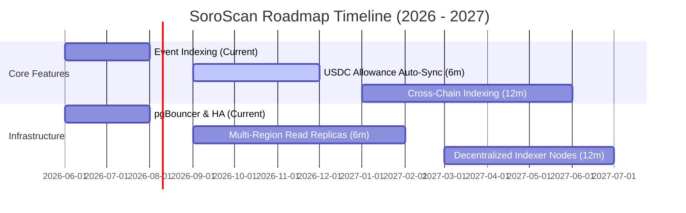

# 🗺️ SoroScan Public Roadmap & Strategic Vision

This document details the long-term vision, technology improvements, planned features, and release cadence for the **SoroScan** ecosystem.

---

## 🎯 Strategic Vision Statement

### Purpose
SoroScan is designed to be the definitive block explorer, indexer, and analytics platform for **Stellar Soroban smart contracts**. We aim to make on-chain recurring payments, smart contract execution, and token flows fully transparent and easily queryable for developers, merchants, and users.

### Project Values
1. **Accessibility**: Open source, highly visual interfaces that make complex contract operations understandable.
2. **Speed & Reliability**: Sub-second API response times and robust data consistency.
3. **Privacy & Security**: Native wallet integrations, no centralized tracking of financial profiles, and audited components.

### Success Criteria
- Indexing latency of `< 1 ledger` behind the live Stellar network.
- 99.9% API uptime (SLO).
- Active developer ecosystem building plugins and integrations.

---

## 🚀 Feature Roadmap

Our feature roadmap is structured into three phases: Current Version, Near-term (Next 6 months), and Long-term (12+ months).

### 1. Current Version Features
- **Ledger & Event Indexing**: Parses and indexes event payloads (`subscribed`, `charged`, `cancelled`, `pay_per_use`) in real-time.
- **Developer API**: REST and GraphQL endpoints querying contract states, subscription details, and historical events.
- **Freighter Wallet Integration**: Core dashboard UI for users to view and revoke token allowances.

### 2. Planned Features (Next 6 Months)
- **USDC Allowance Auto-Sync**: Enhanced indexer parsing Stellar Asset Contract (SAC) events to synchronize user token permissions automatically.
- **Webhooks & Subscriptions**: Outbound HTTP push notifications triggering custom merchant endpoints when an allowance changes or billing charge fails.
- **Advanced Dashboard Metrics**: Historical subscription retention rate, customer lifetime value (LTV), and churn analytics.

### 3. Future Considerations (12+ Months)
- **Multi-Chain Explorer support**: Port indexing components to other Stellar-adjacent virtual machines or protocol integrations.
- **Merchant Custom Portals**: Self-hosted custom UI frames for merchants to manage subscription plans on-chain.

---

## 🛠️ Technical Roadmap

### Architecture Upgrades
- **Microservices Split**: Decouple the event-indexing loop from the web API service. This allows scaling the scraper worker independently of UI traffic.
- **Message Broker Integration**: Introduce RabbitMQ or Apache Kafka between the blockchain reader and the database writer to manage write surges during network spikes.

### Reliability & Performance SLOs
- **Read Latency**: 95% of API requests resolved under `100ms`.
- **Write Consistency**: Ledger state must be fully indexed within `3 seconds` of block finalization on-chain.
- **Database Uptime**: Maintain `99.95%` availability through hot-standby replicas.

---

## 🌐 Infrastructure Roadmap

### Geographic Expansion
Deploy API edge nodes across three key regional centers (North America, Europe, and Asia-Pacific) using global load balancers to minimize network latency.

### Multi-Chain & Network Optimization
- Support Soroban index caching inside edge Content Delivery Networks (CDNs) for static contract read-only states.
- Run dedicated Stellar Horizon/Core validator instances to eliminate dependency on public shared endpoints.

---

## 👥 Community & Ecosystem

### 🔌 SDK Development
Build official SoroScan client SDKs for:
- **Rust**: For native smart contract logging integration.
- **TypeScript/JavaScript**: For quick client application setups.
- **Python**: For analytical workloads and database syncs.

### 🧩 Plugin Ecosystem
Introduce an open interface for developers to write custom indexing handlers. If a developer creates a new Soroban smart contract, they can supply a custom schema file to SoroScan to instantly get custom explorer dashboards.

---

## 📅 Version Release Schedule

We adhere to **Semantic Versioning (SemVer)** principles:
- **Major Releases**: Incremented during breaking updates (e.g., database schema changes without backwards compatibility). Target: 1 per year.
- **Minor Releases**: Incremented for backward-compatible features and optimizations. Target: Every 2 months.
- **Patch Releases**: Bug fixes and security hotfixes. Released as needed.

---

## ⚠️ Known Limitations & Technical Debt

1. **Storage Consumption**: High ledger write-rates require significant disk volumes. We are evaluating long-term WAL compression algorithms.
2. **Re-indexing Speed**: If SoroScan requires a schema change, re-indexing the entire blockchain history from ledger #1 can take up to 24 hours. A future optimization targets concurrent batch indexing using historical database checkpoints.

---

## 💬 Discussion & Community Feedback

We value your input. Share feedback or influence development direction:
- **RFC Process**: For major technical modifications, submit a Request for Comments (RFC) in the [GitHub Discussions - RFC Category](https://github.com/SiLioLabs/PayFlow/discussions).
- **Weekly Meetings**: Join our open planning session every Tuesday at 16:00 UTC on Discord.
