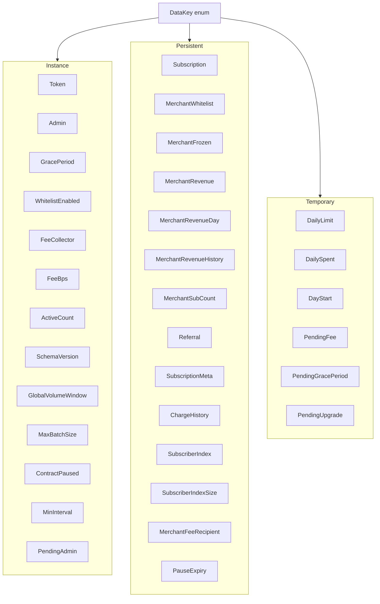

# Storage and TTL Management Architecture

This document is the contributor reference for FlowPay storage: every `DataKey` variant, the value it holds, which Soroban storage tier it uses, how TTL is managed, and which contract functions read or write it.

Stellar's Soroban platform archives unused state to limit ledger growth. Contributors who add keys or touch lifecycle code must choose the correct tier and TTL policy so data neither vanishes unexpectedly nor permanently bloats the ledger.

Source of truth: `DataKey` in [`contract/src/lib.rs`](../../contract/src/lib.rs). Cross-check public entry points in [API.md](../API.md).

---

## 1. Soroban storage tiers

FlowPay uses all three Soroban tiers.

| Storage tier   | Lifecycle                     | When expired                                           | Use in FlowPay                                                         |
| :------------- | :---------------------------- | :----------------------------------------------------- | :--------------------------------------------------------------------- |
| **Instance**   | Tied to the contract instance | Contract becomes unusable until instance TTL is bumped | Protocol-wide config, admin, counters, pause flags                     |
| **Persistent** | Per-key                       | Archived (evicted); can be restored for a fee          | Long-lived per-user / per-merchant state that must not be lost forever |
| **Temporary**  | Per-key                       | **Permanently deleted**; not restorable                | Daily spending caps and short-lived two-step proposals                 |

### When to use each tier

- **Instance** — one shared value for the whole deployment (token default, admin, fee bps, global pause). All instance keys share one TTL budget; FlowPay bumps it via `bump_instance_ttl` / related helpers on mutating paths.
- **Persistent** — anything that must survive idle periods and remain recoverable after archival (subscriptions, revenue, whitelist flags, charge history). Prefer explicit `extend_ttl` on write or on critical reads.
- **Temporary** — values that are safe to forget: daily spend windows that reset naturally, and pending propose/commit payloads that expire if never committed. Never store irreplaceable audit data here.

---

## 2. TTL constants

| Constant / literal          | Value (ledgers) | Approx. time (5s ledgers) | Used for                                                                                             |
| :-------------------------- | --------------: | :------------------------ | :--------------------------------------------------------------------------------------------------- |
| `SUBSCRIPTION_TTL_LEDGERS`  |     `6_307_200` | ~1 year                   | Subscriptions, metadata, charge history, fee recipient, subscriber index slots; instance bump target |
| Merchant-stats literal      |     `1_555_200` | ~90 days                  | Merchant revenue, day buckets, revenue history, merchant sub counts                                  |
| `LEDGERS_PER_DAY` / `17280` |        `17_280` | ~24 hours                 | Daily limit keys; `PendingFee` / `PendingGracePeriod` / `PendingUpgrade`                             |

Subscription persistent keys typically use threshold `SUBSCRIPTION_TTL_LEDGERS / 2` and extend-to `SUBSCRIPTION_TTL_LEDGERS` (see `storage::extend_subscription_ttl`). Some keys bump with full/full. Temporary keys usually extend with threshold = extend-to = `17_280`.

---

## 3. Complete DataKey reference

All variants from `DataKey` in `contract/src/lib.rs` are listed below. “None” under TTL policy means no explicit `extend_ttl` call was found for that key — it relies on network defaults and risks archival if never bumped.

| DataKey                            | Value type                                                        | Storage tier | TTL policy                                                                 | Written by                                                                                                                                                                                                                | Read by                                                                                                                              |
| :--------------------------------- | :---------------------------------------------------------------- | :----------- | :------------------------------------------------------------------------- | :------------------------------------------------------------------------------------------------------------------------------------------------------------------------------------------------------------------------ | :----------------------------------------------------------------------------------------------------------------------------------- |
| `Subscription(Address)`            | `Subscription`                                                    | persistent   | `extend_ttl` ~½→1 year via `extend_subscription_ttl` / `bump_subscription` | `subscribe`, `subscribe_with_metadata`, `charge` / `batch_charge`, `cancel*`, `pause*`, `resume`, `batch_pause_subscriptions`, `set_subscription_amount`, `set_subscription_interval`, `transfer_subscription`, `migrate` | `get_subscription`, charge / PPU / cancel / pause / resume / next-charge helpers, `migrate`, and other flows that load the sub first |
| `Token`                            | `Address`                                                         | instance     | Shares instance TTL (`bump_instance_ttl`)                                  | `initialize`                                                                                                                                                                                                              | `get_token`, `withdraw_merchant_revenue`, `contract_health_check`                                                                    |
| `Admin`                            | `Address`                                                         | instance     | Shares instance TTL                                                        | `initialize` → `admin::initialize_admin`, `accept_admin`, `set_initial_admin`                                                                                                                                             | `get_admin`, `admin::require_admin` callers, `accept_admin`, `contract_health_check`                                                 |
| `GracePeriod`                      | `u64`                                                             | instance     | Instance bump on read/commit                                               | `commit_grace_period`                                                                                                                                                                                                     | `get_grace_period`, `charge`, `batch_charge`, `is_charge_due`, `get_protocol_stats`                                                  |
| `MerchantWhitelist(Address)`       | `bool` (presence = whitelisted)                                   | persistent   | None                                                                       | `add_merchant`, `whitelist_batch_add`; removed by `remove_merchant` / `whitelist_batch_remove`                                                                                                                            | `is_merchant_whitelisted`, `subscribe*`, `pay_per_use_to`                                                                            |
| `WhitelistEnabled`                 | `bool`                                                            | instance     | Shares instance TTL                                                        | `set_whitelist_enabled`                                                                                                                                                                                                   | `is_whitelist_enabled`, `subscribe*`, `pay_per_use_to`, `get_protocol_stats`                                                         |
| `MerchantFrozen(Address)`          | `bool` (presence = frozen)                                        | persistent   | None                                                                       | `freeze_merchant`; removed by `unfreeze_merchant`                                                                                                                                                                         | `is_merchant_frozen`, `subscribe*`                                                                                                   |
| `FeeCollector`                     | `Address`                                                         | instance     | Shares instance TTL                                                        | `commit_fee`; removed by `clear_fee`                                                                                                                                                                                      | `get_fee`, `get_fee_collector`, `get_protocol_stats`, fee transfers in charge / PPU                                                  |
| `FeeBps`                           | `u32`                                                             | instance     | Shares instance TTL                                                        | `commit_fee`; removed by `clear_fee`                                                                                                                                                                                      | `get_fee`, `get_protocol_stats`, fee transfers                                                                                       |
| `ActiveCount`                      | `u64`                                                             | instance     | Shares instance TTL                                                        | `subscribe*` (inc), `cancel*` (dec)                                                                                                                                                                                       | `get_active_count`, `get_protocol_stats`, `contract_health_check`                                                                    |
| `MerchantRevenue(Address)`         | `i128`                                                            | persistent   | `extend_ttl(1_555_200, 1_555_200)` on write                                | charge / PPU → `increment_revenue*`; `reset_merchant_revenue`; `withdraw_merchant_revenue`                                                                                                                                | `get_merchant_revenue`, `withdraw_merchant_revenue`                                                                                  |
| `MerchantRevenueDay(Address, u64)` | `i128`                                                            | persistent   | `extend_ttl(1_555_200, 1_555_200)` on write / `bump_merchant_revenue_day`  | `increment_revenue_with_daily`; removed by `prune_merchant_revenue_days`                                                                                                                                                  | `get_merchant_revenue_day`, `bump_merchant_revenue_day`                                                                              |
| `DailyLimit(Address)`              | `i128`                                                            | temporary    | `extend_ttl(17_280, 17_280)` on set                                        | `set_daily_limit`; removed by `remove_daily_limit`                                                                                                                                                                        | `get_daily_limit`, `pay_per_use*` → `enforce_limit`                                                                                  |
| `DailySpent(Address)`              | `i128`                                                            | temporary    | `extend_ttl(17_280, 17_280)` on `record_spend`                             | `pay_per_use*` → `record_spend`; removed by `remove_daily_limit`                                                                                                                                                          | `get_daily_spent`, `enforce_limit` / `record_spend`                                                                                  |
| `DayStart(Address)`                | `()` unit marker                                                  | temporary    | `extend_ttl(17_280, 17_280)` on first spend of day                         | `record_spend` (if absent); removed by `remove_daily_limit`                                                                                                                                                               | `get_daily_spent`, `record_spend` (`temporary().has`)                                                                                |
| `Referral(Address)`                | `Address`                                                         | persistent   | None                                                                       | `subscribe*` → `store_referral`; removed on `cancel*`                                                                                                                                                                     | `get_referrer`                                                                                                                       |
| `SchemaVersion`                    | `u32`                                                             | instance     | Shares instance TTL                                                        | `migrate` (sets current schema version)                                                                                                                                                                                   | `get_schema_version`, `migrate`, `get_protocol_stats`, `contract_health_check` (defaults to `1` if unset)                            |
| `SubscriptionMeta(Address)`        | `String` (max 64 bytes)                                           | persistent   | `extend_ttl` ~1 year on set                                                | `set_metadata`, `subscribe_with_metadata`; removed by `clear_metadata`                                                                                                                                                    | `get_metadata`, `get_subscription_label`                                                                                             |
| `ChargeHistory(Address)`           | `Vec<u64>` (rolling, max 12)                                      | persistent   | `extend_ttl` ~½→1 year on record                                           | charge → `record_charge`; removed by `clear_charge_history` / `prune_charge_history`                                                                                                                                      | `get_charge_history`, `get_charge_history_page`                                                                                      |
| `GlobalVolumeWindow`               | `GlobalVolumeWindow { current_window_start, accumulated_volume }` | instance     | Shares instance TTL                                                        | charge / PPU → `check_and_update_global_volume`                                                                                                                                                                           | same path (no public getter)                                                                                                         |
| `MaxBatchSize`                     | `u32`                                                             | instance     | Shares instance TTL                                                        | `set_max_batch_size`                                                                                                                                                                                                      | `get_max_batch_size`, `batch_charge` (default `50` if unset)                                                                         |
| `MaxWhitelistBatchSize`            | `u32`                                                             | instance     | Shares instance TTL                                                        | `set_max_whitelist_batch_size`                                                                                                                                                                                            | `get_max_whitelist_batch_size`, `whitelist_batch_add` / `whitelist_batch_remove` / `get_merchant_statuses` (default `50` if unset)   |
| `ContractPaused`                   | `bool`                                                            | instance     | Shares instance TTL                                                        | `pause_contract`, `unpause_contract`                                                                                                                                                                                      | `is_contract_paused`, `get_protocol_stats`, `subscribe*`, `ensure_contract_not_paused`, `contract_health_check`                      |
| `MinInterval`                      | `u64`                                                             | instance     | Shares instance TTL                                                        | `set_min_interval`                                                                                                                                                                                                        | `get_min_interval`, `subscribe*` (default `3600` if unset)                                                                           |
| `MerchantRevenueHistory(Address)`  | `Vec<i128>`                                                       | persistent   | `extend_ttl(1_555_200, 1_555_200)` on append                               | `increment_revenue_with_daily`; removed by `clear_merchant_revenue_history`                                                                                                                                               | `get_merchant_revenue_history`                                                                                                       |
| `SubscriberIndex(u64)`             | `Address`                                                         | persistent   | `extend_ttl` ~1 year on append                                             | `subscribe*` → `append_subscriber_index`                                                                                                                                                                                  | `get_subscriber_at`, `get_subscriber_page`                                                                                           |
| `SubscriberIndexSize`              | `u64`                                                             | persistent   | None on this key                                                           | `append_subscriber_index`                                                                                                                                                                                                 | `get_subscriber_count`, `get_subscriber_page`, `append_subscriber_index`                                                             |
| `MerchantSubCount(Address)`        | `u64`                                                             | persistent   | `extend_ttl(1_555_200, 1_555_200)` on inc/dec                              | `subscribe*` / `cancel*` → merchant sub count helpers                                                                                                                                                                     | `get_merchant_subscriber_count`, `get_merchant_sub_count`                                                                            |
| `PendingAdmin`                     | `Address`                                                         | instance     | Shares instance TTL                                                        | `transfer_admin`; removed by `accept_admin`                                                                                                                                                                               | `accept_admin`                                                                                                                       |
| `PendingFee`                       | `(Address, u32)`                                                  | temporary    | `extend_ttl(17_280, 17_280)` on propose                                    | `propose_fee`; removed by `commit_fee`                                                                                                                                                                                    | `commit_fee`                                                                                                                         |
| `MerchantFeeRecipient(Address)`    | `Address`                                                         | persistent   | `extend_ttl` ~1 year on set                                                | `set_merchant_fee_recipient`                                                                                                                                                                                              | `get_merchant_fee_recipient`; fee transfer during charge                                                                             |
| `PendingGracePeriod`               | `u64`                                                             | temporary    | `extend_ttl(17_280, 17_280)` on propose                                    | `propose_grace_period`; removed by `commit_grace_period`                                                                                                                                                                  | `commit_grace_period`                                                                                                                |
| `PendingUpgrade`                   | `BytesN<32>`                                                      | temporary    | `extend_ttl(17_280, 17_280)` on propose                                    | `propose_upgrade`; removed by `commit_upgrade`                                                                                                                                                                            | `commit_upgrade`                                                                                                                     |
| `PauseExpiry(Address)`             | `u64`                                                             | persistent   | None                                                                       | `pause` (`u64::MAX`), `pause_until`; removed by `resume` / auto-resume in charge                                                                                                                                          | `charge` / `batch_charge` → `try_auto_resume` (no public getter)                                                                     |



---

## 4. TTL management strategy

1. **Instance** — `bump_instance_ttl` runs on mutating entrypoints (`initialize`, `charge`, `pay_per_use`, `cancel`, `pause*` / `resume`, fee/grace propose/commit, whitelist updates, `batch_charge`, subscribe path). Grace get/commit and `extend_subscription_ttl` also refresh instance TTL. (Unlike an earlier short summary that suggested only automatic bumps, the contract **does** call `instance().extend_ttl(...)` explicitly.)
2. **Subscription family** — ~1 year via `SUBSCRIPTION_TTL_LEDGERS` on subscribe, charge, and the public `extend_subscription_ttl` entrypoint for keepers/idle subs.
3. **Merchant revenue family** — ~90 days (`1_555_200`) on write; day buckets can be refreshed with `bump_merchant_revenue_day`.
4. **Temporary day / pending proposals** — ~1 day (`17_280`).
5. **No explicit TTL** — `MerchantWhitelist`, `MerchantFrozen`, `Referral`, `PauseExpiry`, `SubscriberIndexSize` rely on defaults; contributors touching these should consider whether a bump is required.

> [!NOTE]
> Keepers and integrators should monitor TTL of active subscriptions and call `extend_subscription_ttl` if a subscription is paused or idle for a long time, so the key does not archive.

---

## 5. Why temporary storage for DailyLimit

Daily spending limits are a **short-lived** guard on `pay_per_use`, not a permanent account setting.

- Caps live in temporary storage with a ~24-hour TTL (`LEDGERS_PER_DAY` = `17_280`).
- `DayStart` (unit) anchors the calendar window. When it expires, spend is treated as zero for a new day even if a stale `DailySpent` value were somehow present.
- Idle users do not leave permanent ledger entries for limits they no longer use.
- Expired temporary data is **gone forever** (cannot be restored like archived persistent data). That is intentional: daily-limit keys are operational controls, not a long-term archive — see [DAILY-LIMITS.md](../DAILY-LIMITS.md).

`set_daily_limit` writes and bumps TTL; `remove_daily_limit` clears `DailyLimit`, `DailySpent`, and `DayStart` together.

---

## 6. Implementation sketches

### Persistent subscription extension

```rust
fn extend_subscription_ttl(env: &Env, user: &Address) {
    env.storage().persistent().extend_ttl(
        &DataKey::Subscription(user.clone()),
        SUBSCRIPTION_TTL_LEDGERS / 2,
        SUBSCRIPTION_TTL_LEDGERS,
    );
}
```

Called during subscribe, successful charge paths, and the public `extend_subscription_ttl` entrypoint.

### Temporary daily limit

```rust
const LEDGERS_PER_DAY: u32 = 17_280;

pub fn set_daily_limit(env: &Env, user: &Address, limit: i128) {
    let key = DataKey::DailyLimit(user.clone());
    env.storage().temporary().set(&key, &limit);
    env.storage()
        .temporary()
        .extend_ttl(&key, LEDGERS_PER_DAY, LEDGERS_PER_DAY);
}
```

---

## 7. Cross-references

| Area                       | Docs / APIs                                            |
| :------------------------- | :----------------------------------------------------- |
| Public function contracts  | [API.md](../API.md)                                    |
| Two-step `Pending*` flows  | [two-step-auth.md](./two-step-auth.md)                 |
| High-level storage table   | [ARCHITECTURE.md](../ARCHITECTURE.md#storage-strategy) |
| Daily limits product guide | [DAILY-LIMITS.md](../DAILY-LIMITS.md)                  |

When adding a new `DataKey` variant: pick the tier deliberately, document TTL here, wire writers/readers, and update [API.md](../API.md) if a public getter/setter is exposed.
