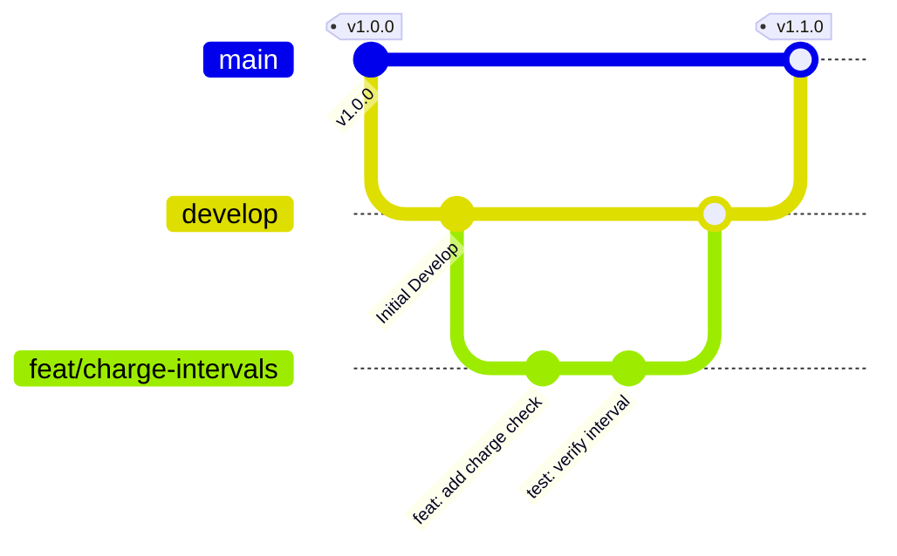

# 🌿 Git Workflow & Commit Conventions

SoroScan uses a structured Git workflow to organize modifications and maintain a clean commit history.

---

## 🏗️ Branching Strategy

Our branching model relies on a main deployment branch and structured feature branches.



### 1. The Long-Lived Branches
- **`main`**: Reflects production-ready state. Only stable, fully tested features are merged here. Directly committing to `main` is forbidden.
- **`develop`**: The primary integration branch. All active development feature branches merge into `develop` first.

### 2. Supporting Branches (Feature/Bugfix)
Create a descriptive branch for your changes:
- `feat/your-feature-name` — for new features.
- `fix/bug-description` — for bug fixes.
- `docs/doc-updates` — for documentation additions.
- `test/improve-coverage` — for testing refinements.
- `refactor/clean-logic` — for non-behavioral edits.

---

## 📝 Commit Message Conventions

We strictly follow the [Conventional Commits](https://www.conventionalcommits.org/en/v1.0.0/) specification. A typical commit structure is:

```
<type>(<scope>): <description>

[optional body]

[optional footer(s)]
```

### Types
- **`feat`**: A new user-facing feature.
- **`fix`**: A bug fix.
- **`docs`**: Documentation changes.
- **`style`**: Changes that do not affect the meaning of the code (formatting, white-space, missing semi-colons, etc).
- **`refactor`**: A code change that neither fixes a bug nor adds a feature.
- **`perf`**: A code change that improves performance.
- **`test`**: Adding missing tests or correcting existing tests.
- **`chore`**: Maintenance tasks (build system, dependencies).

### Examples
*Good*:
```
feat(contract): add pause/resume functionality to subscription
fix(frontend): handle freighter wallet connection rejection gracefully
docs(database): write pgBouncer setup guidelines
```

*Bad*:
```
fixed the bug
minor updates
adding more stuff
```

---

## 🔒 Force Push Rules

- **Protected Branches**: Force pushing (`git push -f`) to `main` or `develop` is strictly disabled via branch protection rules.
- **Feature Branches**: Force pushing to your personal feature branch is permitted and encouraged during the code review process to squash commits, clean history, or rebase on top of upstream changes.
  - *Recommendation*: Use `git push --force-with-lease` instead of `-f`. This prevents accidentally overwriting work pushed by collaborators.

---

## 🥞 Squashing vs. Rebasing

We prefer a clean, linear history.

- **Squashing**: When merging a Pull Request into `develop` or `main`, we use **Squash and Merge**. This compresses all commits on your feature branch into a single cohesive commit on the integration branch.
- **Rebasing**: Before requesting review, update your branch by rebasing it on top of the latest `develop` branch. Do not merge `develop` *into* your branch (which creates unnecessary merge commits).
  ```bash
  # Step-by-step rebase guide
  git checkout develop
  git pull origin develop
  git checkout feat/your-feature
  git rebase develop
  
  # Resolve conflicts if any, then:
  git push origin feat/your-feature --force-with-lease
  ```

---

## 🍒 Cherry-Picking Policy

- Cherry-picking (`git cherry-pick <commit-hash>`) is reserved for **hotfixes** that need to be ported from `develop` directly to `main` (or vice-versa) before a scheduled release.
- When cherry-picking, always use the `-x` flag to append the original commit hash to the commit message:
  ```bash
  git cherry-pick -x <commit-hash>
  ```
