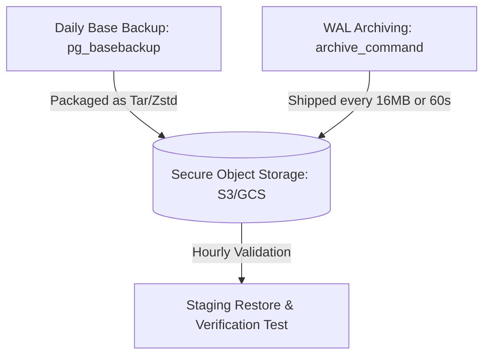
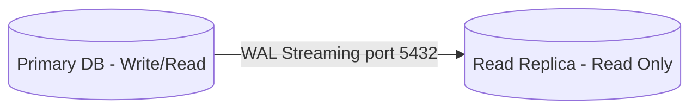

# 🗄️ PostgreSQL & Redis Administration Guide

This guide details the operations, maintenance, troubleshooting, and disaster recovery procedures for **SoroScan's** database and caching infrastructure. It covers PostgreSQL administration, connection pooling, safe migrations, automated maintenance, slow query analysis, Redis operations, and monitoring.

---

## 🏛️ PostgreSQL Administration

SoroScan utilizes PostgreSQL as its primary persistent store for indexed Soroban events, account metadata, and transaction history.

### 💾 Backup Strategy (Full & Incremental)
We follow a hybrid backup strategy combining **Physical Base Backups** (full backups) and **Continuous Archiving (Write-Ahead Logging - WAL)** for incremental backups.



- **Full Backups**: Executed daily using `pg_basebackup` or `pg_dump` (for logical backups).
- **Incremental Backups**: Continuous WAL archiving to secure object storage (e.g., AWS S3 or Google Cloud Storage) using tools like **pgBackRest** or native PostgreSQL WAL shipping.
- **Retention Policy**:
  - Daily full backups: Retained for 30 days.
  - Weekly full backups: Retained for 90 days.
  - Continuous WAL archives: Retained for 14 days (supports PITR window).

---

### 🕒 Automated Backup Scheduling
Automated backups are orchestrated using `cron` (for simple setups) or Kubernetes CronJobs. Below is an example of an automated shell script for logical backups and a cron template.

#### Backup Script: `backup_postgres.sh`
```bash
#!/usr/bin/env bash
set -eo pipefail

# Configuration
DB_NAME=${DB_NAME:-"soroscan"}
DB_USER=${DB_USER:-"postgres"}
BACKUP_DIR=${BACKUP_DIR:-"/var/backups/postgres"}
S3_BUCKET=${S3_BUCKET:-"soroscan-db-backups"}
DATE=$(date +%Y%m%d_%H%M%S)
FILENAME="${DB_NAME}_backup_${DATE}.sql.gz"
LOCAL_PATH="${BACKUP_DIR}/${FILENAME}"

echo "Starting PostgreSQL backup for ${DB_NAME} at $(date)..."

# Ensure backup directory exists
mkdir -p "${BACKUP_DIR}"

# Run pg_dump (Custom format, compressed)
PGPASSWORD="${DB_PASSWORD}" pg_dump -h localhost -U "${DB_USER}" -F c -b -v -f "${LOCAL_PATH}" "${DB_NAME}"

# Upload to S3/Object Storage
echo "Uploading ${FILENAME} to S3..."
aws s3 cp "${LOCAL_PATH}" "s3://${S3_BUCKET}/daily/${FILENAME}"

# Keep local copy for 3 days, delete older
find "${BACKUP_DIR}" -name "${DB_NAME}_backup_*.sql.gz" -mtime +3 -delete

echo "PostgreSQL backup completed successfully."
```

#### Crontab Schedule
Add the following to `/etc/cron.d/postgres_backup` (runs every day at 02:00 AM UTC):
```cron
0 2 * * * postgres /usr/local/bin/backup_postgres.sh >> /var/log/postgres/backup.log 2>&1
```

---

### 🔄 Restore Procedures & Testing
To restore a custom-format dump (`-F c`), use `pg_restore`. Always verify backups on a staging instance.

#### 1. Restore to a Fresh Database
```bash
# Create target database
createdb -h localhost -U postgres soroscan_restore

# Restore database schema and data
pg_restore -h localhost -U postgres -d soroscan_restore --no-owner --role=soroscan_app -j 4 /var/backups/postgres/soroscan_backup_latest.sql.gz
```
> [!IMPORTANT]
> The `-j 4` flag enables parallel processing using 4 CPU cores, drastically reducing restore time. Adjust based on your server capacity.

---

### ⏱️ Point-in-Time Recovery (PITR)
PITR allows restoring the database to the exact millisecond before a critical error or data corruption occurred.

#### Prerequisites in `postgresql.conf`
```ini
wal_level = replica
archive_mode = on
archive_command = 'test ! -f /mnt/server/archivedir/%f && cp %p /mnt/server/archivedir/%f'
restore_command = 'cp /mnt/server/archivedir/%f %p'
```

#### Steps to Perform PITR
1. **Stop PostgreSQL Server**:
   ```bash
   pg_ctl -D /var/lib/postgresql/data stop
   ```
2. **Move Existing Data Files**:
   Keep `postgresql.conf`, `pg_hba.conf`, and system certificates. Clear the rest of `/var/lib/postgresql/data`.
3. **Restore the Closest Base Backup**:
   Extract your physical base backup into the data directory.
4. **Create a `recovery.signal` file**:
   This triggers PostgreSQL to start in recovery mode.
   ```bash
   touch /var/lib/postgresql/data/recovery.signal
   ```
5. **Configure Recovery Settings** in `postgresql.conf` (or `postgresql.auto.conf`):
   ```ini
   restore_command = 'cp /mnt/server/archivedir/%f %p'
   recovery_target_time = '2026-06-24 12:00:00 UTC'
   recovery_target_action = 'promote'
   ```
6. **Start PostgreSQL**:
   ```bash
   pg_ctl -D /var/lib/postgresql/data start
   ```
   PostgreSQL will replay WAL files up to the target time and promote itself to primary.

---

### ⛓️ Replication Setup
For high availability, SoroScan utilizes **Physical Streaming Replication** with one Primary and one or more Read Replicas.



#### Primary Node Config (`postgresql.conf`)
```ini
listen_addresses = '*'
wal_level = replica
max_wal_senders = 10
wal_keep_size = 4096MB # Minimum size of WAL files kept for standby
hot_standby = on
```

#### Setup Standby Replication using `pg_basebackup`
On the standby node (with Postgres stopped and data directory empty):
```bash
pg_basebackup -h <primary-host> -D /var/lib/postgresql/data -U replicator -P -R --wal-method=stream
```
- The `-R` flag creates `standby.signal` and configures the connection parameters in `postgresql.auto.conf` automatically.
- Start PostgreSQL on the standby node to start streaming.

---

### 🔌 Connection Pooling (pgBouncer)
Direct database connections are expensive in PostgreSQL due to the process-based model. We deploy **pgBouncer** in front of PostgreSQL to manage connection concurrency.

#### Recommended `pgbouncer.ini` Settings
```ini
[databases]
soroscan = host=127.0.0.1 port=5432 dbname=soroscan

[pgbouncer]
logfile = /var/log/postgresql/pgbouncer.log
pidfile = /var/run/postgresql/pgbouncer.pid
listen_addr = *
listen_port = 6432
auth_type = scram-sha-256
auth_file = /etc/pgbouncer/userlist.txt
pool_mode = transaction
max_client_conn = 5000
default_pool_size = 50
min_pool_size = 10
reserve_pool_size = 5
reserve_pool_timeout = 5
```

> [!NOTE]
> **Transaction Pooling Mode** (`pool_mode = transaction`) is recommended for indexers like SoroScan because connections are returned to the pool as soon as the transaction ends. Note that prepared statements must be handled correctly in your ORM/backend application.

---

## ⚡ Database Migrations

Migrations modify the database schema without destroying existing data. In SoroScan, we primarily support Alembic or Django ORM migrations.

### 🔄 Migration Workflow
```
[Local Dev] Create Model Change ──> Run makemigrations/revision ──> Test Up/Down locally ──> PR Review ──> CI (Dry-run check) ──> CD Deploy (Autocommit off)
```
1. **Isolation**: Never perform DDL modifications manually in production.
2. **Deterministic Versioning**: All migrations must be checked into git.
3. **Dual-phase execution**: Schema upgrades should happen independently of codebase deployments.

---

### 🛡️ Writing Safe Migrations (No Locks)
DDL statements can lock tables, causing application downtime. Follow these rules:

#### 1. Adding Columns with Default Values
*Bad*: Adding a column with a default value directly rewritten onto a huge table.
*Good*: In PostgreSQL 11+, adding a nullable column with a default value is instant because it only updates the system catalog. For older versions, add the column without default, backfill in batches, then add the `NOT NULL` constraint.

#### 2. Creating Indexes (Use `CONCURRENTLY`)
Creating indexes blocks writes to the table. Always use `CONCURRENTLY`.

```sql
-- Safe migration index creation script
CREATE INDEX CONCURRENTLY idx_events_contract_ledger 
ON soroban_events (contract_id, ledger_sequence);
```

#### 3. Adding Foreign Key Constraints
Adding a foreign key locks both tables. Create it as `NOT VALID`, then validate it later:
```sql
ALTER TABLE soroban_events 
ADD CONSTRAINT fk_events_ledgers 
FOREIGN KEY (ledger_sequence) REFERENCES ledgers (sequence) NOT VALID;

-- Validate constraint (does not acquire exclusive table locks)
ALTER TABLE soroban_events VALIDATE CONSTRAINT fk_events_ledgers;
```

---

### ⏪ Rolling Back Migrations
Every migration file must have a corresponding `downgrade` (Alembic) or rollback strategy.
- **Django**: Run `python manage.py migrate app_name <previous_migration_number>`.
- **Alembic**: Run `alembic downgrade -1` (or specify the revision ID).

> [!WARNING]
> Always verify that a rollback does not delete columns containing business-critical data without a verified backup.

---

### 📦 Large Table Migrations
For tables with >10M rows (such as `soroban_events` or `transactions`):
- **Batching**: Perform updates, deletes, or inserts in batches of 5,000–10,000 rows.
- **Tooling**: Use tools like `pg_repack` to reclaim space without locking tables.

---

### 🌐 Zero-Downtime Deployment Strategy
For zero-downtime database upgrades, use the **Expand/Contract Pattern**:
1. **Expand**: Deploy a migration that adds the new schema elements (e.g., new column/table). Keep writing to both old and new tables/columns.
2. **Backfill**: Run a script to copy old data to the new columns in small, indexed batches.
3. **Deploy Code**: Deploy the new application version that reads/writes *only* from/to the new schema.
4. **Contract**: Deploy a migration to drop the old schema elements (e.g., drop old columns) once the application has fully transitioned.

---

## 🧹 Maintenance Tasks

Routine database maintenance keeps PostgreSQL performing optimally and prevents database degradation.

### 📊 Index Maintenance
Indexes fragment over time, especially on tables with high delete/update volumes.
- **ANALYZE**: Run `ANALYZE` after large inserts/deletes to update planner statistics.
- **REINDEX CONCURRENTLY**: Rebuilds indexes to clear bloat without locking out writes.
  ```sql
  REINDEX INDEX CONCURRENTLY idx_events_contract_ledger;
  ```

---

### ⚙️ Autovacuum Configuration
Autovacuum cleans up dead tuples (row versions) left behind by updates/deletes. SoroScan is a write-heavy indexer and needs aggressive autovacuuming.

Add these overrides to `postgresql.conf`:
```ini
autovacuum = on
autovacuum_max_workers = 5
autovacuum_vacuum_scale_factor = 0.05       # Trigger vacuum when 5% of rows change
autovacuum_analyze_scale_factor = 0.02      # Trigger analyze when 2% of rows change
autovacuum_vacuum_cost_limit = 1000        # Increase limits to run vacuum faster
autovacuum_vacuum_cost_delay = 2ms          # Reduce sleep time for vacuum workers
```

---

### 🔍 Table Bloat Monitoring
Run this query to check for space wasted by dead tuples (bloat) in your top tables:

```sql
SELECT
  schemaname,
  relname AS table_name,
  n_dead_tup AS dead_tuples,
  n_live_tup AS live_tuples,
  ROUND(n_dead_tup * 100.0 / NULLIF(n_dead_tup + n_live_tup, 0),2) as dead_tuple_ratio
FROM pg_stat_user_tables
WHERE (n_dead_tup + n_live_tup) > 10000
ORDER BY dead_tuples DESC;
```

---

### 💾 Disk Space Management
Set an alert when disk usage exceeds **80%**. Once it reaches **95%**, PostgreSQL will go into read-only transaction mode or shut down to avoid transaction ID wraparound.

---

### 🏥 Regular Health Checks
Run this health check query to monitor connection distribution:

```sql
SELECT 
  datname AS db_name,
  state,
  count(*) AS connection_count
FROM pg_stat_activity
GROUP BY datname, state;
```

---

## 🕵️ Query Troubleshooting

Identify and resolve slow-running SQL queries.

### 🐢 Finding Slow Queries
Ensure `pg_stat_statements` is enabled in `postgresql.conf`:
```ini
shared_preload_libraries = 'pg_stat_statements'
```

Run this query to find the top 5 slowest queries by total execution time:
```sql
SELECT 
  query,
  calls,
  total_exec_time / 1000.0 AS total_seconds,
  mean_exec_time AS mean_ms,
  rows
FROM pg_stat_statements
ORDER BY total_exec_time DESC
LIMIT 5;
```

---

### 🗺️ EXPLAIN PLAN Analysis
Use `EXPLAIN (ANALYZE, BUFFERS)` to analyze slow queries. Look out for:
- **Seq Scan**: Indicates a missing index or incorrect query planning.
- **Filter**: Rows filtered after scanning. Try creating a covering index.
- **Buffers (Shared Read)**: Reading from disk instead of RAM cache.

```sql
EXPLAIN (ANALYZE, BUFFERS)
SELECT * FROM soroban_events 
WHERE contract_id = 'CC...XYZ' AND ledger_sequence > 1234567;
```

---

### 🛠️ Query Optimization Techniques
- **Partial Indexes**: If indexing static values, index only active subsets.
  ```sql
  CREATE INDEX idx_active_subscriptions ON subscriptions (user_id) WHERE is_active = true;
  ```
- **Covering Indexes (INCLUDE)**: Add columns directly into index leaves to enable Index-Only Scans.
  ```sql
  CREATE INDEX idx_events_covering ON soroban_events (contract_id) INCLUDE (event_type, topic);
  ```

---

## 🏎️ Redis Administration

SoroScan uses Redis for high-speed caching of API responses, rate limiting, and pub/sub for WebSocket event notifications.

### 💾 Redis Persistence (AOF vs RDB)
We use a hybrid persistence approach matching the usage profile:

| Persistence Mode | Setting | Purpose |
| --- | --- | --- |
| **RDB (Snapshotting)** | `save 900 1` | Point-in-time snapshots for disaster recovery. |
| **AOF (Append Only File)** | `appendonly yes` | Logs every write operation. Restores data with zero loss. |

#### `redis.conf` Configuration
```ini
appendonly yes
appendfsync everysec
no-appendfsync-on-rewrite yes
auto-aof-rewrite-percentage 100
auto-aof-rewrite-min-size 64mb
```

---

### 🧠 Memory Management and Eviction
To prevent Redis crashes from Out-of-Memory (OOM), we configure strict memory limits.

```ini
maxmemory 4gb
maxmemory-policy volatile-lru
```
- **Eviction Policy**: `volatile-lru` evicts keys with an expire set using the LRU (Least Recently Used) algorithm. This ensures that session caches and rate limit counters are not prematurely lost, while ephemeral caches expire gracefully.

---

### ⏳ Key Expiration Strategy
Every key created from the SoroScan indexer must have an explicit Time-to-Live (TTL) configured to prevent memory leakage.
- Rate-limit keys: **1 minute**.
- API Response caches: **5–15 minutes**.
- Active subscription state: **1 hour** (automatically updated on charge event).

---

### 🩺 Monitoring Redis Health
Run these Redis CLI commands to check health metrics:
- **General Health**: `redis-cli ping` (should return `PONG`).
- **Detailed Stats**: `redis-cli info stats` and `redis-cli info memory`.
- **System Doctor**: `redis-cli memory doctor` to diagnose fragmentation and allocation anomalies.

---

## 📈 Monitoring & Alerts

### 🚨 PostgreSQL Metrics to Monitor
1. **Connection Usage**: `active_connections / max_connections > 0.85` (Alert: Warning).
2. **CPU & IO Wait**: Disk I/O bottlenecks or CPU usage > 90%.
3. **Replication Lag**: Standby replica delay in bytes/seconds (`pg_wal_lsn_diff`).
4. **Transaction ID Wraparound**: Check the age of oldest transaction.
5. **Cache Hit Ratio**: Ideally `> 99%`.
   ```sql
   SELECT 
     sum(heap_blks_read) as heap_read,
     sum(heap_blks_hit)  as heap_hit,
     sum(heap_blks_hit) / (sum(heap_blks_hit) + sum(heap_blks_read) + 1) as ratio
   FROM pg_statio_user_tables;
   ```

### 🚨 Redis Metrics to Monitor
1. **Memory Fragmentation Ratio** (`mem_fragmentation_ratio`): If `> 1.5`, a Redis restart or memory defragmentation (`active-defrag yes`) is required.
2. **Evicted Keys** (`evicted_keys`): Rising numbers mean `maxmemory` limit needs to be increased.
3. **Connected Clients** (`connected_clients`): Track client counts. Keep below 10,000.

---

## ☄️ Disaster Recovery

### 🔬 Backup Verification Procedures
Backups are only as good as their restores. We automate restore tests every Sunday:
1. Spin up a temporary staging container.
2. Download the latest backup from S3.
3. Execute restore and log success status.
4. Run validation queries checking if the latest indexed ledger matches expected ranges.

### ⏱️ Recovery Time Objective (RTO) & Recovery Point Objective (RPO)
- **RTO (Target Restore Time)**: `< 2 hours`.
- **RPO (Target Data Loss)**: `< 5 minutes` (enforced by continuous WAL shipping to S3).

### 🛠️ DR Execution Checklist (Runbook)
1. **Declare Outage**: Inform team and spin up incident Slack/Teams channel.
2. **Identify Root Cause**: Determine if it is a corrupted disk, user error, or regional cloud outage.
3. **Provision Target Node**: Build fresh PG cluster in another cloud region if needed.
4. **Initiate Restore**: Restore base backup, mount WAL storage volume, configure PITR timestamp if target time is known.
5. **Verify Data Consistency**: Match block height with Stellar Network validator metrics.
6. **Redirect Traffic**: Switch pgBouncer endpoints or DNS target records.
7. **Post-Mortem**: Document root cause and timeline within 24 hours.
