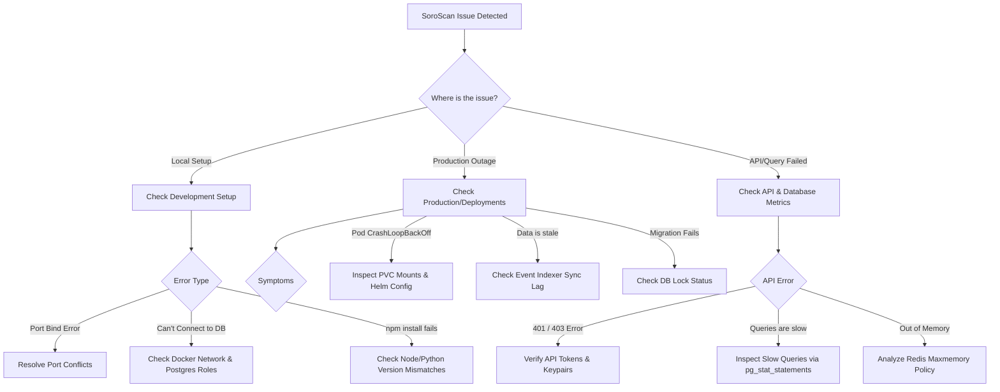

# 🔍 SoroScan Troubleshooting Guide & FAQ

Welcome to the SoroScan Troubleshooting Guide. Use the Table of Contents below to quickly find resolution steps for common issues encountered during development, testing, deployment, and operations.

---

## 🗺️ Diagnostic Decision Tree

If your application is experiencing issues but you don't know the cause, use this flowchart to identify the system component to investigate.



---

## 📥 Development Setup Troubleshooting

### 1. Port Conflicts (e.g., `Address already in use`)
- **Symptom**: `Error: listen EADDRINUSE: address already in use :::5432` or `:::6379`.
- **Cause**: An instance of PostgreSQL or Redis is already running natively on your host machine.
- **Resolution**:
  Identify and terminate the process using the port, or change the exposed port in your `docker-compose.yml`:
  ```bash
  # Find process running on port 5432
  sudo lsof -i :5432
  
  # Terminate native postgres
  sudo systemctl stop postgresql
  # Or kill by PID
  kill -9 <PID>
  ```

### 2. Database Permission Issues
- **Symptom**: `FATAL: role "soroscan_app" does not exist` or `permission denied for table ...`.
- **Cause**: Database user role was not initialized, or lacks grants to tables created by migration scripts.
- **Resolution**:
  Connect to PostgreSQL as administrative superuser (`postgres`) and assign permissions:
  ```sql
  CREATE ROLE soroscan_app WITH LOGIN PASSWORD 'your_password';
  GRANT ALL PRIVILEGES ON DATABASE soroscan TO soroscan_app;
  GRANT USAGE, SELECT ON ALL SEQUENCES IN SCHEMA public TO soroscan_app;
  GRANT SELECT, INSERT, UPDATE, DELETE ON ALL TABLES IN SCHEMA public TO soroscan_app;
  ```

### 3. Docker Networking Problems
- **Symptom**: `dial tcp: lookup postgres on 127.0.0.1:53: no such host`.
- **Cause**: Application container is trying to connect to `localhost:5432` instead of using the Docker internal DNS name.
- **Resolution**:
  In Docker Compose networks, containers resolve each other by service name. Update your `.env.local` config:
  - Change `DB_HOST=127.0.0.1` to `DB_HOST=postgres` (where `postgres` is the service name).
  - Ensure all containers are configured under the same network bridge in `docker-compose.yml`.

### 4. Node / Python Version Mismatches
- **Symptom**: Rust compiler or node-gyp compilation failures during `npm install` or Python package installations.
- **Cause**: Node.js or Python versions are incompatible with codebase configuration.
- **Resolution**:
  Use Node Version Manager (`nvm`) or Python `pyenv` to lock versions:
  ```bash
  # Node: Ensure Node.js 18+ is active
  nvm install 18
  nvm use 18
  
  # Python: Ensure Python 3.10+ is active
  pyenv install 3.10.12
  pyenv global 3.10.12
  ```

### 5. Dependency Conflicts
- **Symptom**: `npm ERR! code ERESOLVE: unable to resolve dependency tree`.
- **Cause**: Conflicting version requirements between frontend dependencies.
- **Resolution**:
  ```bash
  npm install --legacy-peer-deps
  ```

---

## 🛠️ Development Workflow Issues

### 1. Hot Reload Not Working
- **Symptom**: React changes in `frontend/src/` do not update the UI automatically.
- **Cause**: File system notifications (inotify limits) reached their limit in Linux, or using WSL without enabling polling.
- **Resolution**:
  Increase inotify limits:
  ```bash
  echo fs.inotify.max_user_watches=524288 | sudo tee -a /etc/sysctl.conf && sudo sysctl -p
  ```
  For WSL2 environment, update `vite.config.ts` to enable polling:
  ```typescript
  server: {
    watch: {
      usePolling: true
    }
  }
  ```

### 2. WebSocket Connection Failures
- **Symptom**: Live indexer events fail to stream; browser console outputs `WebSocket connection to 'ws://...' failed`.
- **Cause**: Reverse proxy (Nginx or Ingress) is not configured to upgrade headers to WebSockets.
- **Resolution**: Ensure your Nginx configuration contains:
  ```nginx
  proxy_set_header Upgrade $http_upgrade;
  proxy_set_header Connection "upgrade";
  ```

---

## 🌐 Production Troubleshooting

### 1. Application Won't Start (CrashLoopBackOff)
- **Symptom**: Kubernetes pods are continuously crashing.
- **Cause**: Health check liveness probes are failing, or the app cannot resolve dependencies.
- **Resolution**:
  1. Inspect pod logs:
     ```bash
     kubectl logs <pod-name> --previous
     ```
  2. Describe the pod to see events:
     ```bash
     kubectl describe pod <pod-name>
     ```
  3. Verify that database migrations completed *before* the application starts (e.g. use an initContainer).

### 2. Database Migration Failures
- **Symptom**: Deployment hangs during migrations, or outputs `Active transactions blocking table modifications`.
- **Cause**: Another session holds an exclusive lock on the table being modified.
- **Resolution**:
  Find and terminate blocking transactions. See **[PostgreSQL Administration](file:///workspaces/PayFlow/docs/database/administration.md#index-maintenance)**.
  ```sql
  SELECT pid, query, state, age(clock_timestamp(), query_start) 
  FROM pg_stat_activity 
  WHERE state != 'idle' AND age(clock_timestamp(), query_start) > interval '5 minutes';
  
  -- Terminate blocking process
  SELECT pg_cancel_backend(<pid>);
  ```

### 3. Event Processing Sync Lag
- **Symptom**: SoroScan is several hours behind the actual Stellar ledger height.
- **Cause**: High transaction volume on Stellar Testnet/Mainnet causing the indexer queue to bottleneck, or database transaction pooling limits reached.
- **Resolution**:
  1. Check indexer queue depth in Redis: `LLEN event_queue`.
  2. Increase number of worker pods to scale processing concurrently.
  3. Ensure database queries on `soroban_events` utilize appropriate indexes.

---

## 🛡️ API Troubleshooting

### 1. 401 / 403 Authentication Errors
- **Symptom**: API calls return `401 Unauthorized` or `403 Forbidden`.
- **Cause**: Invalid JWT token, expired Stellar signature, or missing authorization headers.
- **Resolution**:
  - Verify headers are formatted as `Authorization: Bearer <token>`.
  - Check that the server clock is synced via NTP (clock drift of >60 seconds invalidates signatures).

### 2. Rate Limit Problems
- **Symptom**: API queries return `429 Too Many Requests`.
- **Cause**: Client has exceeded the allowed query limit (tracked in Redis).
- **Resolution**:
  - Request developer api credentials to increase limit.
  - Implement exponential backoff in client-side requests:
    ```javascript
    const delay = Math.pow(2, retryAttempt) * 1000;
    setTimeout(executeRequest, delay);
    ```

---

## ⚡ Performance Issues

### 1. Slow API Responses
- **Symptom**: Endpoint latency exceeds 500ms.
- **Cause**: Lack of query indexing, caching failures, or slow database responses.
- **Resolution**:
  - Run the slow queries analysis script detailed in **[Query Troubleshooting](file:///workspaces/PayFlow/docs/database/administration.md#query-troubleshooting)**.
  - Enable caching in Redis for frequently requested endpoints.

### 2. High Database CPU Usage
- **Symptom**: DB server CPU usage stays at 100%.
- **Cause**: Sequential scans on tables missing indexes, or autovacuum is starved.
- **Resolution**:
  - Identify sequential scans using pg_stat_statements.
  - Optimize SQL queries using query planners.
  - Adjust Autovacuum parameters to be more aggressive to clear bloat.

---

## 🚀 Deployment Issues

### 1. Helm Chart Errors
- **Symptom**: `Error: failed to parse Chart.yaml: tags must be unique`.
- **Cause**: Invalid formatting or duplicate keys in `values.yaml` files.
- **Resolution**:
  Run Helm linter before running upgrading releases:
  ```bash
  helm lint ./charts/soroscan
  ```

### 2. PVC Mount Failures
- **Symptom**: `Multi-Attach error for volume ... volume is already used by Pod`.
- **Cause**: ReadWriteOnce PVC is being mounted by a replacement pod before the old pod has finished terminating.
- **Resolution**:
  Modify pod update strategy to use `Recreate` rather than `RollingUpdate` for stateful services:
  ```yaml
  spec:
    strategy:
      type: Recreate
  ```

---

## ❓ Frequently Asked Questions

### Q: How do I rebuild my local DB environment from scratch?
Run the following clean command to reset Postgres and Redis containers:
```bash
docker-compose down -v && docker-compose up -d --build
```
The `-v` flag ensures all database volume files are deleted.

### Q: Why does the indexer stop scanning after a ledger reset?
On Stellar Testnet, ledgers are periodically reset (every quarter). When this occurs, the genesis ledger sequence number resets. You must clear the indexer state database and reset the `last_scanned_ledger` pointer to 0.

### Q: What is the difference between `instance` and `persistent` storage in Soroban?
- `instance`: Low-cost storage shared across the smart contract code. Ideal for configuration parameters (e.g., Token ID).
- `persistent`: Standard storage for user-specific data (allowances, balance state). Requires regular rent payment in XLM to keep from expiring.

---

## 🚨 Emergency Procedures

### 1. Rollback Procedure
If a production deployment is corrupted:
1. **Application Rollback**:
   ```bash
   # Kubernetes Rollback
   kubectl rollout undo deployment/soroscan-backend
   ```
2. **Database Rollback**:
   If a migration broke functionality, run rollbacks on schema. Refer to **[Rolling Back Migrations](file:///workspaces/PayFlow/docs/contributing/git_workflow.md#force-push-rules)**.

### 2. Data Recovery
To recover state in case of hardware or volume corruption:
1. Halt indexer tasks.
2. Spin up a new database cluster.
3. Follow the restore procedures using the last daily physical backup. See **[Disaster Recovery](file:///workspaces/PayFlow/docs/database/administration.md#disaster-recovery)**.
4. Execute WAL recovery up to the point of failure.

### 3. DDoS Mitigation
- **Rate Limit Tweak**: Change the Redis rate limiting threshold from 100req/min to 10req/min for public IP endpoints.
- **Cloudflare Shield**: Route all API traffic behind Cloudflare Web Application Firewall (WAF) and enable Under Attack Mode.
